  

   

  
  
  

## Profile

I'm **Fery**, a Telkom University student who enjoys working where code, design, and curiosity meet. I build web products, explore decentralized technology, and care about making every experience feel intentional.

<table>
  <tr>
    <td width="50%" valign="top">
      <h3>Now</h3>
      

        Building full-stack web experiences and strengthening my TypeScript, Laravel, and Web3 foundations.
      

    </td>
    <td width="50%" valign="top">
      <h3>Beyond code</h3>
      

        Exploring UI/UX, digital art, and photography to bring a stronger visual point of view into my work.
      

    </td>
  </tr>
</table>

> I turn curiosity into digital experiences people can actually use.

## Toolkit

  
DEVELOPMENT

  

    

  
WORKFLOW &amp; CREATIVE

  

## GitHub

  <picture>
    <source media="(prefers-color-scheme: dark)" srcset="https://github-profile-summary-cards.vercel.app/api/cards/stats?username=nihfery&theme=github_dark" />
    <source media="(prefers-color-scheme: light)" srcset="https://github-profile-summary-cards.vercel.app/api/cards/stats?username=nihfery&theme=transparent" />
    
  </picture>
  <picture>
    <source media="(prefers-color-scheme: dark)" srcset="https://github-profile-summary-cards.vercel.app/api/cards/repos-per-language?username=nihfery&theme=github_dark" />
    <source media="(prefers-color-scheme: light)" srcset="https://github-profile-summary-cards.vercel.app/api/cards/repos-per-language?username=nihfery&theme=transparent" />
    
  </picture>

 

  <picture>
    <source media="(prefers-color-scheme: dark)" srcset="https://raw.githubusercontent.com/nihfery/nihfery/output/github-contribution-grid-snake-dark.svg" />
    <source media="(prefers-color-scheme: light)" srcset="https://raw.githubusercontent.com/nihfery/nihfery/output/github-contribution-grid-snake.svg" />
    
  </picture>

 

  OPEN TO COLLABORATION · LET'S BUILD SOMETHING WITH PURPOSE

